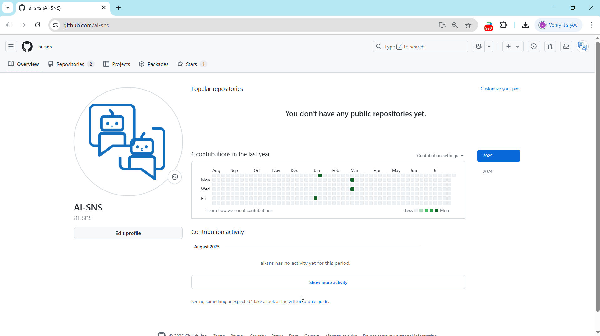

<p align="center">
  
</p>


English | [中文介绍](readme_zh.md)

# 🧠 Matrix AI | Matrix-Style AI Chat Terminal


[](https://platform.openai.com/)
[](https://github.com/moses-palmer/pynput)
> ✨ **Let AI serve you in the coolest way possible!**
> Immerse yourself in a Matrix-inspired terminal chat — where retro meets intelligence.

---

## 🔥 Project Overview

**Matrix AI** is a visually striking AI chat terminal that replicates the iconic green matrix interface from *The Matrix*. It supports streaming conversations, global hotkeys, asynchronous responses, and more — crafted for developers and creatives who crave immersive interaction.

---

## ✨ Key Features

### 🖥️ Immersive Matrix-Style Interface

* 🎬 **Matrix-style terminal UI** replicating the iconic green character stream
* ⌨️ **Typewriter-style output** showing text character by character
* 💫 **Smooth window animations**, including zoom, transparency, and rounded corners
* 🌓 **Modern + Retro fusion**, combining vintage terminal feel with modern UI animations


### ⚙️ Technical Highlights

* 🔍 **Global hotkey listener**: Double-tap `Ctrl`/`Shift`/`ESC` to control the terminal
* ⚡ **Async streaming conversation**: Supports OpenAI-compatible APIs (DeepSeek, Grok, Mistral, etc.) with real-time responses
* 🧠 **Multi-turn context memory**: Chat history awareness enables coherent multi-round dialogues
* 💡 **Smart focus control**: Auto window management for seamless human-AI interaction



### 🛡️ Thoughtful UX Design

* 🕶️ Non-intrusive background running — won’t interrupt your workflow
* 🧩 Highly configurable — supports multiple AI API backends compatible with OpenAI
* 🚀 Fast triggering + immersive chatting, built for productivity and flow

---

## 📦 Feature Modules Overview

| Module Name         | Description                                      |
|---------------------| ------------------------------------------------ |
| `KeyboardListener`  | Hotkey monitoring and window control             |
| `MatrixInputWindow` | Terminal input with animation and focus handling |
| `MatrixTextDisplay` | Streaming text display with typewriter animation |
| `OpenAIStreamer`    | Async request handling + context management      |
| `Config File`       | JSON config loader with dynamic API switching    |

### 🧪 Special Commands

```bash
Double Ctrl     - Launch input window (Double Control key on macOS)
Double Shift    - Show/hide current window
Single ESC      - End current conversation
Double ESC      - Quit and close the app
/new or /reset  - Start a new conversation
```

---

## 🚀 Getting Started

### 💻 System Requirements

* OS: Windows 10/11, macOS
* Python: 3.11 (Python 3.13 may have issues)
* Recommended Resolution: 1920x1080+

### 📦 Install Dependencies

```bash
pip install -r requirements.txt

**** OR ****
# Windows
pip install pynput openai

# macOS
pip install pynput openai pyobjc
```

### ⚙️ Configure `config.json`

```json
{
  "base_url": "https://api.openai.com/v1",
  "api_key": "your-api-key-here",
  "model": "gpt-4o-mini"
}
```

> 💡 You can replace `base_url` to use OpenAI-compatible APIs such as DeepSeek, Grok, Mistral, etc.

---

## 🧑‍💻 Usage Guide

### 📂 Run the App

```bash
python matrixai.py
```

> 💡 Currently developed with Python 3.11. Python 3.13+ is not supported.

### ⌨️ Hotkey Overview

| Action       | Description              |
| ------------ | ------------------------ |
| Double Ctrl  | Open input terminal      |
| Double Shift | Toggle window visibility |
| Single ESC   | End current conversation |
| Double ESC   | Exit the application     |

### 📖 Chat Flow

1. Launch the terminal and type your question
2. AI responds in real time with animated character output
3. Enter `/new` to start a new conversation

---

## 🖼️ Screenshots & UI Preview

> Simulated terminal output:

```
>>> MATRIX AI TERMINAL <<<

>>> USER [14:30:25] <<<
Hello, how are you today?

AI IS THINKING...

>>> AI [14:30:27] <<<
I'm functioning well, thank you! How can I assist you today?

--- RESPONSE COMPLETE ---
[Round 1 | History: 2 messages]
```


---

## 🧩 Troubleshooting & Tips

### Common Issues

| Issue                | Solution                                |
| -------------------- | --------------------------------------- |
| API not working      | Check network and API key configuration |
| Hotkeys unresponsive | Run app with administrator privileges   |
| UI lag or stutter    | Close background-heavy apps             |
| Config not working   | Ensure `config.json` is valid JSON      |

### Tips

* Use `Shift + Enter` to insert a newline
* Use `Ctrl + C` to copy selected text (on Mac: `Cmd + C`)
* Use `/new` to begin a fresh conversation

---

## 🤝 Contributing

Want to help improve Matrix AI?

* 📥 Submit issues to report bugs or request features
* 🚀 Open pull requests to contribute new features
* ⭐ Star this repo to support ongoing development

---

## 📄 License

This project is released under the [MIT License](LICENSE) — free to use, modify, and distribute.

---

## 🔗 Resources

* [OpenAI API Docs](https://platform.openai.com/docs)
* [Pynput Global Hotkeys](https://github.com/moses-palmer/pynput)

---

> Let the terminal be more than just a terminal — make it your coolest AI companion. 🧠💻

