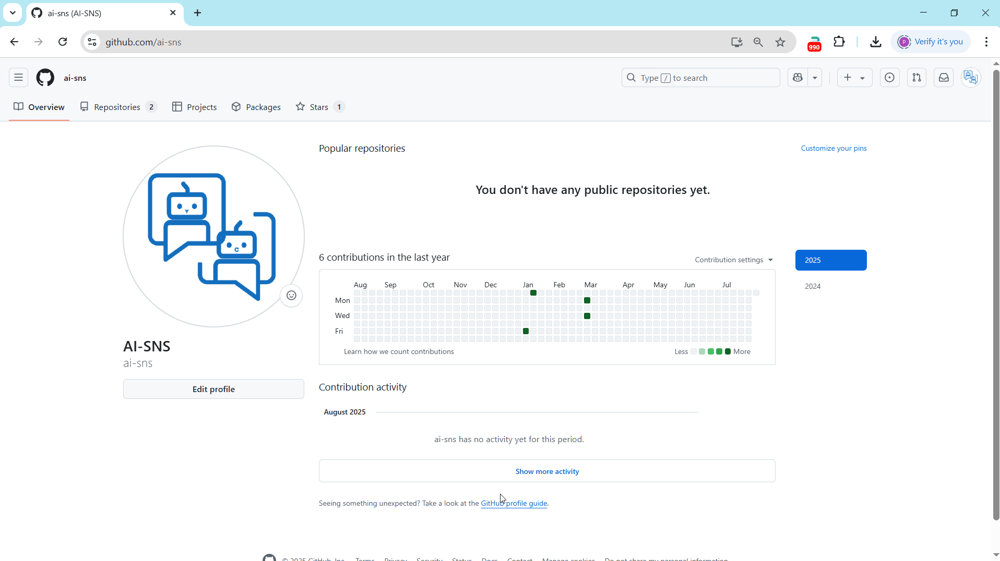

<p align="center">
  
</p>

[English](README.md) | 中文

# 🧠 Matrix AI | 黑客帝国风格的 AI 聊天终端


[](https://platform.openai.com/)
[](https://github.com/moses-palmer/pynput)

> ✨ **让 AI 以最酷的方式为你服务！** 体验黑客帝国风格的终端式对话，让终端不止于复古，更具智能。 

---

## 🔥 项目简介

**Matrix AI** 是一个极具视觉冲击力的终端 AI 聊天工具，模拟《黑客帝国》中经典绿色矩阵界面，支持流式对话、全局热键唤起、异步响应等特性，专为注重沉浸式交互体验的开发者与创意工作者打造。

---

## ✨ 功能亮点

### 🖥️ 极具风格的界面体验

* 🎬 **Matrix 风格终端界面**，复刻《黑客帝国》的绿色字符流
* ⌨️ **打字机式输出**，每个字符逐步显示，增强沉浸感
* 💫 **窗口动画效果**，缩放动效、透明过渡、圆角设计
* 🌓 **现代 + 复古融合**，复古终端结合现代动画风格


### ⚙️ 技术与功能优势

* 🔍 **全局快捷键监听**：双击 Ctrl/Shift/ESC 控制终端窗口
* ⚡ **异步流式对话**：支持 OpenAI(DeepSeek,Grok,Mistral等)流式输出，无需等待完整回答
* 🧠 **多轮上下文支持**：对话具备记忆能力，支持连续交流
* 💡 **智能焦点管理**：自适应窗口控制，极致人机交互



### 🛡️ 用户体验设计

* 🕶️ 零侵入后台运行，不打扰你的日常工作
* 🧩 高度可配置，支持多服务商 API 接入，目前支持与openai兼容的服务商接口
* 🚀 快速调用 + 沉浸对话，专为效率与沉浸体验打造

---

## 📦 功能模块一览

| 模块名称                | 功能简述                      |
|---------------------| ------------------------- |
| `KeyboardListener`  | 热键监听与窗口控制（Ctrl、Shift、ESC） |
| `MatrixInputWindow` | 用户输入终端 + 动画 + 焦点管理        |
| `MatrixTextDisplay` | 流式文本展示 + 打字机动画            |
| `OpenAIStreamer`    | 异步流式请求 + 上下文管理            |
| `配置文件`              | JSON配置支持 + 动态加载 + 多服务商    |

### 🧪 特殊命令支持

```bash
双击 Ctrl 载入输入框,(Mac电脑双击Control)
双击 Shift 隐藏/显示 当前窗口
单击 ESC 结束当前对话
双击 ESC 关闭整个应用并退出
/new 或 /reset    # 对话框中输入该指令开始新的对话

```

---

## 🚀 快速开始

### 💻 系统要求

* 操作系统：Windows 10/11，macOS
* Python：3.11 (3.13可能有问题)
* 推荐分辨率：1920x1080+

### 📦 安装依赖

```bash
pip install -r requirements.txt

**** OR ****
# Windows
pip install pynput openai

# Mac
pip install pynput openai pyobjc

```

### ⚙️ 配置 `config.json`

```json
{
  "base_url": "https://api.openai.com/v1",
  "api_key": "your-api-key-here",
  "model": "gpt-4o-mini"
}
```

> 💡 可替换 `base_url` 使用 deepseek, grok,Mistral 等和Openai接口兼容的服务商。

---

## 🧑‍💻 使用指南

### 📂 运行应用

```bash
python matrixai.py
```
> 💡 注意不支持python 3.13以上版本，当前使用python 3.11版本开发。

### ⌨️ 快捷键操作

| 操作      | 功能      |
|---------|---------|
| 双击 Ctrl | 唤出输入窗口  |
| 双击 Shift | 隐藏/显示窗口 |
| 单击 ESC  | 结束当前对话  |
| 双击 ESC  | 安全退出应用  |

### 📖 对话流程

1. 打开终端后输入问题
2. AI 实时回应，文字逐字符显示
3. 输入 `/new` 开启新话题


---

## 🖼️ 截图与界面预览

> 终端仿真效果如下：

```
>>> MATRIX AI TERMINAL <<<

>>> USER [14:30:25] <<<
Hello, how are you today?

AI IS THINKING...

>>> AI [14:30:27] <<<
I'm functioning well, thank you! How can I assist you today?

--- RESPONSE COMPLETE ---
[Round 1 | History: 2 messages]
```


---

## 🧩 故障排查 & 使用技巧

### 常见问题

| 问题       | 解决方案                    |
| -------- | ----------------------- |
| 无法调用 API | 检查网络与 API Key 配置        |
| 热键无响应    | 以管理员权限运行应用              |
| 动画卡顿     | 关闭其他高占用应用               |
| 配置无效     | 检查 `config.json` 格式是否正确 |

### 使用技巧

* `Shift + Enter` 实现输入换行
* `Ctrl + C` 复制选中的文本(Mac上为Command + C)
* `/new` 开启新对话

---

## 🤝 贡献方式

欢迎参与改进 Matrix AI：

* 📥 提交 Issue 反馈问题或建议
* 🚀 发起 Pull Request 贡献新特性
* ⭐ Star 本仓库支持作者持续开发！

---

## 📄 License

本项目基于 [MIT License](LICENSE) 开源发布。自由使用、修改、分发。

---

## 🔗 相关资源

* [OpenAI API 文档](https://platform.openai.com/docs)
* [Pynput 热键监听](https://github.com/moses-palmer/pynput)


---

> 让终端不仅仅是终端，而是你最酷的 AI 伙伴。🧠💻

